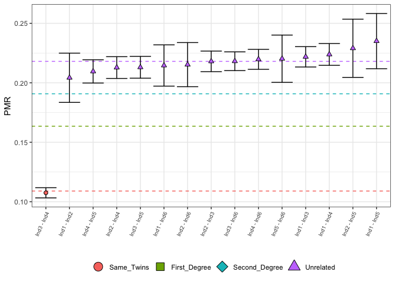

<!-- README.md is generated from README.Rmd. Please edit that file -->

# BREAD

<!-- badges: start -->
<!-- badges: end -->

The goal of BREAD is to calculate kinship from SNP data.

## Installation

You can install the development version of BREAD from
[GitHub](https://github.com/) with:

``` r
# install.packages("devtools")
devtools::install_github("jonotuke/BREAD")
```

## Example

This is a basic example which shows you how to solve a common problem:

First we load a basic counts example.

``` r
library(BREAD)
counts_example
#>           pair nsnps mismatch       pmr
#> 1  Ind1 - Ind2  1518      310 0.2042161
#> 2  Ind1 - Ind3  9435     2093 0.2218336
#> 3  Ind1 - Ind4  8283     1854 0.2238319
#> 4  Ind1 - Ind5  1336      314 0.2350299
#> 5  Ind1 - Ind6  2242      481 0.2145406
#> 6  Ind2 - Ind3  9119     1988 0.2180064
#> 7  Ind2 - Ind4  7984     1699 0.2128006
#> 8  Ind2 - Ind5  1179      270 0.2290076
#> 9  Ind2 - Ind6  1965      423 0.2152672
#> 10 Ind3 - Ind4 20952     2253 0.1075315
#> 11 Ind3 - Ind5  7994     1703 0.2130348
#> 12 Ind3 - Ind6 10994     2398 0.2181190
#> 13 Ind4 - Ind5  6924     1451 0.2095609
#> 14 Ind4 - Ind6  9745     2141 0.2197024
#> 15 Ind5 - Ind6  1739      383 0.2202415
```

We can get the call of kin using

``` r
relatedness_example <- callRelatedness(counts_example)
relatedness_example
#> # A tibble: 15 × 13
#>      row pair    relat…¹   pmr      sd misma…² nsnps ave_rel Same_Tw…³ First_D…⁴
#>    <int> <chr>   <fct>   <dbl>   <dbl>   <dbl> <dbl>   <dbl>     <dbl>     <dbl>
#>  1     1 Ind1 -… Unrela… 0.204 0.0103      310  1518   0.218 6.71e- 26 2.00e-  4
#>  2     2 Ind1 -… Unrela… 0.222 0.00428    2093  9435   0.218 1.22e-214 2.41e- 47
#>  3     3 Ind1 -… Unrela… 0.224 0.00458    1854  8283   0.218 2.00e-194 3.44e- 44
#>  4     4 Ind1 -… Unrela… 0.235 0.0116      314  1336   0.218 2.68e- 37 5.07e- 10
#>  5     5 Ind1 -… Unrela… 0.215 0.00867     481  2242   0.218 9.82e- 46 2.62e-  9
#>  6     6 Ind2 -… Unrela… 0.218 0.00432    1988  9119   0.218 5.06e-195 1.97e- 40
#>  7     7 Ind2 -… Unrela… 0.213 0.00458    1699  7984   0.218 4.95e-156 3.85e- 29
#>  8     8 Ind2 -… Unrela… 0.229 0.0122      270  1179   0.218 1.80e- 30 7.62e-  8
#>  9     9 Ind2 -… Unrela… 0.215 0.00927     423  1965   0.218 1.10e- 40 1.81e-  8
#> 10    10 Ind3 -… Same_T… 0.108 0.00214    2253 20952   0.218 1   e+  0 1.39e-116
#> 11    11 Ind3 -… Unrela… 0.213 0.00458    1703  7994   0.218 6.83e-157 1.84e- 29
#> 12    12 Ind3 -… Unrela… 0.218 0.00394    2398 10994   0.218 2.05e-235 8.68e- 49
#> 13    13 Ind4 -… Unrela… 0.210 0.00489    1451  6924   0.218 1.92e-127 5.79e- 22
#> 14    14 Ind4 -… Unrela… 0.220 0.00419    2141  9745   0.218 2.95e-214 1.08e- 45
#> 15    15 Ind5 -… Unrela… 0.220 0.00994     383  1739   0.218 3.64e- 39 6.79e-  9
#> # … with 3 more variables: Second_Degree <dbl>, Unrelated <dbl>, BF <chr>, and
#> #   abbreviated variable names ¹​relationship, ²​mismatch, ³​Same_Twins,
#> #   ⁴​First_Degree
```

``` r
plotLOAF(relatedness_example)
#> No minimum number of overlapping SNPs given.
#> Using default minimum of 500.
#> No upper limit on number of pairs to plot given.
#> Plotting first 15 pairs.
#> Warning: Ignoring unknown parameters: linewidth
```



``` r
plotSLICE(relatedness_example, row = 1)
```


    #> TableGrob (2 x 2) "arrange": 3 grobs
    #>   z     cells    name                grob
    #> 1 1 (2-2,1-1) arrange      gtable[layout]
    #> 2 2 (2-2,2-2) arrange      gtable[layout]
    #> 3 3 (1-1,1-2) arrange text[GRID.text.170]

``` r
saveSLICES(relatedness_example)
```

``` r
test_degree(relatedness_example, 1, 1)
#> Testing H0       : "Ind1 - Ind2" are 1st-degree relatives.
#> Expected PMR     : 0.1635
#> Observed PMR     : 0.2042
#> Estimated degree : 2.9826
#> p-value          : 2.666909e-05
#> Decision         : Reject H0
#> [1] 2.666909e-05
```

This is new
