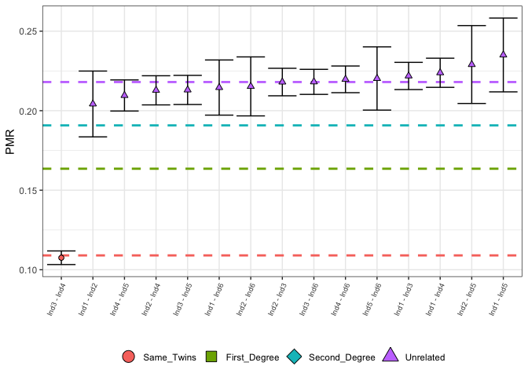
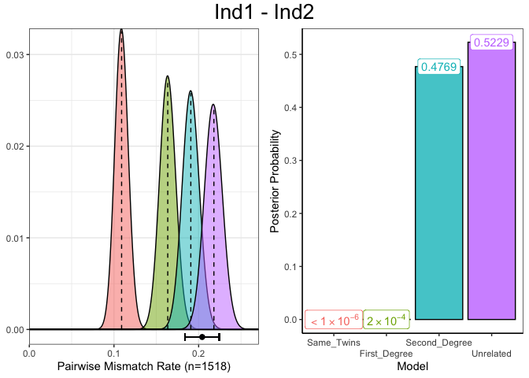

<!-- README.md is generated from README.Rmd. Please edit that file -->

# BREADR

<!-- badges: start -->

[](https://github.com/jonotuke/BREADR/actions/workflows/R-CMD-check.yaml)
<!-- badges: end -->

The goal of BREADR is to provide an easy-to-use method for estimating
degrees of relatedness (up to the second degree) for extremely
low-coverage data. BREADR also allows users to quantify and visualise
the level of confidence in the estimated degrees of relatedness.

The method requires Eigenstrat files (an ind, geno and snp file) to
begin, allowing the user to account for DNA deamination when genotyping
their data.

## Installation

To install, you can use the usual

``` r
install.packages("BREADR")
```

You can install the development version of BREADR from
[GitHub](https://github.com/) with:

``` r
# install.packages("remotes")
remotes::install_github("jonotuke/BREADR")
```

## Example

This basic example shows you how to analyse a real (anonymised) ancient
DNA data set.

An analysis would normally start by defining paths to all three
Eigenstrat files, i.e.,

``` r
ind_path <- 'path_to_eigenstrat_indfile'
snp_path <- 'path_to_eigenstrat_snpfile'
geno_path <- 'path_to_eigenstrat_genofile'
```

and we would then preprocess this data using the processEigenstrat()
function,

``` r
counts_example <- processEigenstrat(indfile = ind_path, snpfile = snp_path, genofile = geno_path)
```

Since this step is the most computationally expensive, we include an
option to automatically save the output as a TSV upon completion of the
preprocessing, i.e, to avoid repeating the preprocessing

``` r
counts_example <- processEigenstrat(indfile = ind_path, snpfile = snp_path, genofile = geno_path, 
                                    outfile = 'path_to_save_tsv')
```

Also included are options to change the minimum distance between
overlapping sites (filter_length) from the default $1\times 10^5,$ an
option to only include individuals (pop_pattern) from certain
populations (as defined in the ind file) and an option to remove C-\>T
and G-\>A SNPs to avoid the effects of deamination.

Note that since the Eigenstrat files are too large to include, we
provide a pre-processed data set called counts_example which is the
product of running processEigenstrat() on real data (although the raw
Eigenstrat files can be found on the Github page).

We now load the counts_example tibble.

``` r
library(BREADR)
counts_example
#>           pair nsnps mismatch       pmr
#> 1  Ind1 - Ind2  1518      310 0.2042161
#> 2  Ind1 - Ind3  9435     2093 0.2218336
#> 3  Ind1 - Ind4  8283     1854 0.2238319
#> 4  Ind1 - Ind5  1336      314 0.2350299
#> 5  Ind1 - Ind6  2242      481 0.2145406
#> 6  Ind2 - Ind3  9119     1988 0.2180064
#> 7  Ind2 - Ind4  7984     1699 0.2128006
#> 8  Ind2 - Ind5  1179      270 0.2290076
#> 9  Ind2 - Ind6  1965      423 0.2152672
#> 10 Ind3 - Ind4 20952     2253 0.1075315
#> 11 Ind3 - Ind5  7994     1703 0.2130348
#> 12 Ind3 - Ind6 10994     2398 0.2181190
#> 13 Ind4 - Ind5  6924     1451 0.2095609
#> 14 Ind4 - Ind6  9745     2141 0.2197024
#> 15 Ind5 - Ind6  1739      383 0.2202415
```

We can we can estimate the degrees of relatedness from the raw counts
using the callRelatedness() function. Users have the option to change
the prior probability for each degree of relatedness (class_prior) from
the default uniform prior, to define the expected PMR
(average_relatedness) for a pair of unrelated individuals from the
default of the sample median, and to set the minimum number of
overlapping SNPs required for a pair of individuals (filter_n) to be
included in the analysis from the default of 1. If the user decides to
use the sample median as an estimate for the expected PMR for a pair of
unrelated individuals, the minimum number of overlapping SNPs for a pair
(median_co) can be changed from the default of 500.

``` r
relatedness_example <- callRelatedness(counts_example)
relatedness_example
#> # A tibble: 15 × 12
#>      row pair       relationship   pmr      sd mismatch nsnps ave_rel Same_Twins
#>    <int> <chr>      <fct>        <dbl>   <dbl>    <dbl> <dbl>   <dbl>      <dbl>
#>  1     1 Ind1 - In… Unrelated    0.204 0.0103       310  1518   0.218  6.71e- 26
#>  2     2 Ind1 - In… Unrelated    0.222 0.00428     2093  9435   0.218  1.22e-214
#>  3     3 Ind1 - In… Unrelated    0.224 0.00458     1854  8283   0.218  2.00e-194
#>  4     4 Ind1 - In… Unrelated    0.235 0.0116       314  1336   0.218  2.68e- 37
#>  5     5 Ind1 - In… Unrelated    0.215 0.00867      481  2242   0.218  9.82e- 46
#>  6     6 Ind2 - In… Unrelated    0.218 0.00432     1988  9119   0.218  5.06e-195
#>  7     7 Ind2 - In… Unrelated    0.213 0.00458     1699  7984   0.218  4.95e-156
#>  8     8 Ind2 - In… Unrelated    0.229 0.0122       270  1179   0.218  1.80e- 30
#>  9     9 Ind2 - In… Unrelated    0.215 0.00927      423  1965   0.218  1.10e- 40
#> 10    10 Ind3 - In… Same_Twins   0.108 0.00214     2253 20952   0.218  1   e+  0
#> 11    11 Ind3 - In… Unrelated    0.213 0.00458     1703  7994   0.218  6.83e-157
#> 12    12 Ind3 - In… Unrelated    0.218 0.00394     2398 10994   0.218  2.05e-235
#> 13    13 Ind4 - In… Unrelated    0.210 0.00489     1451  6924   0.218  1.92e-127
#> 14    14 Ind4 - In… Unrelated    0.220 0.00419     2141  9745   0.218  2.95e-214
#> 15    15 Ind5 - In… Unrelated    0.220 0.00994      383  1739   0.218  3.64e- 39
#> # ℹ 3 more variables: First_Degree <dbl>, Second_Degree <dbl>, Unrelated <dbl>
```

An overall picture of the relatedness for these individuals can be
created, which displays the highest posterior probability degree of
relatedness for each pair of individuals, indicated by the colour and
shape of the points with 95% confidence intervals. The dashed horizontal
lines indicated the expected values for each degree of relatedness.

Users can choose to remove individuals with less than a user-defined
number of overlapping SNPs (nsnps_cutoff). In large data sets, it is
expected that the vast majority of individuals will be unrelated, and so
the user may wish to only plot the more closely related individuals. TO
this end, the user may choose to plot only the first $N$ individuals
(using the input parameter N), which have been sorted by PMR value, in
ascending order.

``` r
plotLOAF(relatedness_example)
#> No minimum number of overlapping SNPs given.
#> Using default minimum of 500.
#> No upper limit on number of pairs to plot given.
#> Plotting first 15 pairs.
```



A plot for the assignment of the “Unrelated” degree of relatedness to
individuals Ind1 and Ind2 can be produced which shows diagnostic
information about the estimated genetic relatedness between a single
pair of individuals. In the left panel, the distribution of PMR values
for each degree of relatedness, given the number of overlapping SNPs,
with the observed PMR (and 95% confidence interval) displayed below
this. In the right panel are the normalised posterior probabilities for
the each of the degrees of relatedness, indicating the certainty with
which the degree of relatedness with the highest posterior probability
was chosen.

``` r
plotSLICE(relatedness_example, row = 1)
```


Alternatively we can choose the row using the full pair name instead of
the row number.

``` r
plotSLICE(relatedness_example, row = "Ind1 - Ind2")
```



We can test whether the observed PMR between Ind1 and Ind2 is consistent
with a 3rd-degree genetic relationship, or not, but any degree of
relatedness from 0 to 10 can be investigated. This function returns the
p-value from the associated binomial test, and by setting verbose to
TRUE, all diagnostic output from the test can be displayed

``` r
test_degree(relatedness_example, 1, 3, verbose = TRUE)
#> Testing H0       : "Ind1 - Ind2" are 3rd-degree relatives.
#> Expected PMR     : 0.2044
#> Observed PMR     : 0.2042
#> Estimated degree : 2.9826
#> p-value          : 0.9823
#> Decision         : Retain H0
#> [1] 0.9823165
```
