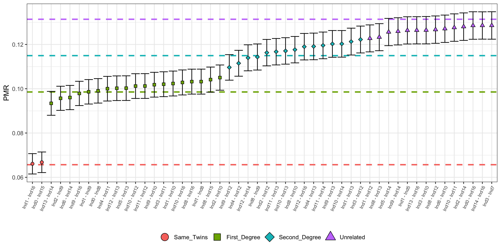

# Summary

Robust and reliable estimates of how individuals are biologically related to each other are a key source of information when reconstructing pedigrees. In combination with contextual data, reconstructed pedigrees can be used to infer possible kinship practices in prehistoric populations. However, standard methods to estimate biological relatedness from genome sequence data cannot be applied to low coverage sequence data, such as are common in ancient DNA (aDNA) studies. Critically, a statistically robust method for assessing and quantifying the confidence of a classification of a specific degree of relatedness for a pair of individuals, using low coverage genome data, is lacking.

In this paper we present the R-package `BREADR` (**B**iological **RE**latedness from **A**ncient **D**NA in **R**), which leverages the so-called pairwise mismatch rate, calculated on optimally-filtered genome-wide pseudo-haploid sequence data, to estimate genetic relatedness up to the second degree, assuming an underlying binomial distribution. `BREADR` also returns a posterior probability for each degree of relatedness, from identical twins/same individual, first-degree, second-degree or “unrelated” pairs, allowing researchers to quantify and report the uncertainty, even for very low-coverage data. We show that this method accurately recovers degrees of relatedness for sequence data with coverage as low as 0.04X using simulated data (produced as in Popli et al.[@popli:2023]).

# Statement of need

`BREADR` is an R package for use in ancient DNA studies, and any studies estimating genetic kinship with extremely low-coverage DNA sequence data, such as in the forensic sciences. `BREADR` is designed to be a user-friendly software package, using as input pseudo-haploid genotype data in the Eigenstrat format, common in aDNA studies, and allowing for pre-processing quality control by researchers.

# State of the Field

Most software packages for estimating genetic relatedness from aDNA sequence data leverage some measure of pairwise genetic dissimilarity, often calculated on pseudo-haploid data, where a random call is sampled for each site, to avoid the issue of phasing.

lcMLkin uses genotype likelihoods to estimate identity-by-descent coefficients ($k_0$, $k_1$ and $k_2$), from which the co-ancestry coefficient can be calculated, such that $theta = k_{1}/4+k_{2}/2$ [@lipatov:2015]. This method requires a reference panel to estimate the genotype likelihoods, and for sites to be unlinked. This method is exploratory in nature, and does not return hard classifications of degrees of relatedness, and is (currently) not peer-reviewed.

TKGWV2 instead estimates relatedness via the method of moments estimator from Queller and Goodnight, denoted $\hat{r}_{ij}$ [@fernandes:2021]. This asymmetric estimator assumes no inbreeding in the population and that all sites are unlinked [@queller:1989]. Hence, TKGWV2 cannot be applied to SNP capture data, or data from populations where inbreeding has occurred. This method returns hard classifications of the degree of relatedness based on which expected value of $rˆij$ the observed value is closest to.

KIN [@popli:2023] and ancIBD [@ringbauer:2023] instead use the spatial distribution of identical-by-descent segments (IBDs). Like lcMLkin, KIN estimates the identity-by-descent coefficients, using IBDs instead of weighted genotype likelihoods, and can identify degrees of relatedness up to the third degree. Conversely, ancIBD uses imputation to increase the resolution of the method up to the seventh-degree. However, this additional resolution comes at the cost of requiring relatively high-coverage sequence data, approximately 0.25X for whole genome sequencing, compared to 0.05X, 0.026X or 0.04X for KIN, TKGV2 and BREADR, respectively.

READ and READv2 use the so-called pairwise-mismatch rate (PMR) to estimate the proportion of overlapping sites for which two individuals have non-matching genotype calls [@monroy:2018; @alaccamli:2024]. The PMR was first introduced to overcome the limitations of low-coverage aDNA, however, the publication from Kennett *et al.* did not include a hard-classification method [@kennett:2017]. Where Kennett *et al.* used all of the available overlapping sites to estimate the PMR, READ uses a 1MB windowed approach to sample from the distribution of the PMR, but also to account for the effects of linkage disequilibrium (LD), allowing for the automated hard classification of degrees of relatedness. READv2, however, uses a genome-wide estimate in place of the windowed approach of READ.

Like READ and READv2, BREARD estimates the PMR, but instead thins the data to reduce the effects of LD. The PMR on this thinned data can now be reasonably expected to follow a binomial distribution, and theoretical expectations of the PMR are derived and compared to the observed value. From this, statistically rigorous measures of uncertainty are derived, and informative diagnostic plots of the degree of related for pairs of individuals can be produced. Finally, although BREADR only classifies degrees of related up to the second-degree, we also allow for tests of any degree up to the tenth-degree to be formally tested when considering potential pedigree reconstructions.

# Current Applications

`BREADR` produces ready-for-publication results and diagnostic plots, and has already seen use in a number of publications [@rivollat:2023; @penske:2024; @gretzinger:2024; @ghalichi:2024; @pilli:2024].

# Estimating Degrees of Relatedness

Consider two individuals, $i$ and $j$, with $N_{ij}$ overlapping sites (without missingness), where sites are thinned (default value $1\times 10^{5}$) such that the effects of LD are reduced. We then look at the number of pseudo-haploid genotype calls that do not match, denoted $X_{ij}$. Hence we have that $X_{ij} \sim \text{Bin}(N_{ij} , p_{ij})$, and that the maximum likelihood estimator for $p_{ij}$ is $\hat{p}_{ij} = X_{ij} /N_{ij}$.

Once all PMRs are calculated, we must account for background relatedness, which can be thought of as the expected PMR for a pair of unrelated individuals, which will differ between populations and sequencing types (such as capture versus shotgun sequencing). Many choices exist for this value, but assuming that a sampled dataset is made up of mostly unrelated pairs (to the second degree), then the median PMR, denoted $\bar{p}$ will be a reliable estimate [@monroy:2018]. However, we also allow $\bar{p}$ to be a user-supplied parameter, which may be known from previous studies, or can be varied for sensitivity analyses. 

Borrowing from the insights of READ, we now define the expected mean PMR for a relationship of degree $k = 0, 1, 2$ to be

$$
p_k = \bar{p}\left(1 - \frac{1}{k+1} \right).
$$

Hence, if we assume that the degree of relatedness for individuals $i$ and $j$ is truly of the $k$<sup>th</sup> degree, then $X_{ij} \sim \text{Bin}(N_{ij} , p_{k})$.

Hence, the likelihood function for relatedness degree $k$, for individuals $i$ and $j$, is 

$$
	L\left( X_{ij} \big| K=k, N_{ij} \right) = \binom{N_{ij}}{X_{ij}} p_k^{X_{ij}}(1-p_k)^{N_{ij}-X_{ij}}.
$$

If we let $k = \infty$ be the case that two individuals are “unrelated” (i.e. more than second-degree related), but then we also have that

$$
\begin{aligned}
P\left(  X_{ij} \big| K \geq 3, N_{ij}\right) &= \sum_{k=3}^{\infty} P\left(K=k \big| X_{ij},N_{ij} \right) P\left( K=k \right)\\
&= \binom{N_{ij}}{X_{ij}} p_k^{X_{ij}}(1-p_k)^{N_{ij}-X_{ij}} f_{\lambda}(k),
\end{aligned}
$$

where $f_{\lambda}(k)$ is the 3-truncated Poisson distribution of the form

$$
	f_{\lambda}(k) = \frac{1}{\sum_{\ell=0}^{2} \frac{\lambda^\ell e^{-\lambda}}{\ell!}}\left( \frac{\lambda^ke^{-\lambda}}{k!}  \right).
$$

We choose the 3-truncated Poisson distribution with $\lambda=10$ as it represents well the unlikelihood of individuals always being closely related once they are more than second-degree related, but also captures the diminishing probabilities of being too distantly-related due to the finite size of populations.

It is then possible to calculate the normalised posterior probabilities of individuals $i$ and $j$ being $k$<sup>th</sup> degree related as

$$
P\left( K=k \big| X_{ij}, N_{ij} \right) = \frac{L\left( X_ij | K=k,N_{ij} \right)P\left(K=k\right)}{\left[ \sum_{\ell=0}^{2} L\left( X_{ij} \big| K = \ell, N_{ij} \right) \right] + L\left(X_{ij}  \big| K\geq 3, N_{ij} \right)}
$$

for which the denominator equals one, by construction. Hence,

$$
	P\left( K=k \big| X_{ij}, N_{ij} \right) = L\left( X_ij | K=k,N_{ij} \right)P\left(K=k\right).
$$

However, the prior probabilities for the degrees of relatedness are unclear, and will vary from study to study, and so these are given as an uninformative uniform distribution by default. Since these are user inputs, they should be thought about carefully, and can be explored via sensitivity analyses to explore if the prior probabilities are driving the relatedness classifications.

Finally, while we do not include third-degree or higher relationships in the possible classifications, we do include a method for a statistical test for retaining or rejecting the possibility of a kth-degree relationship, for $0 \leq k \leq 10$. For this, we perform a binomial test for the observed number of mismatches $X_{ij}$, and the expected probability of pairwise mismatches, as defined in Equation 1, returning a two-sided p-value and the estimated (non-integer) degree of relatedness, found by setting $p_k = p_{ij}$ and $k = \hat{k}$ into Equation 2, and solving for $k$, i.e.,

$$
	\hat{k} = \frac{ln(1-p_{ij}/\hat{p})}{ln(1/2)},
$$

if $p_{ij}<\hat{p}$, and set $\hat{k} = \infty$ otherwise, with $k=\infty$ denoting "unrelated".

# Example Usage

To show an example of how one might use `BREADR` to analyse some data, we simulated genotype data from a pedigree of individuals as shown in \autoref{fig:pedigree}. This pedigree has 2 genetically identical pairs of individuals, 19 first-degree relatives, 12 second-degree relatives (2 of which are half-siblings) and 87 unrelated pairs of individuals. The pedigree also contains a further 9, 6 and 1 third-, fourth- and fifth-degree relatives, respectively, although our method does not attempt to directly identify these deeper relationships. The simulated data resulted in genotypes being called for 29,767,814 segregating sites, at an average of 0.04X coverage.


The package `BREADR` is available under the MIT license from the Comprehensive R Archive Network (CRAN) at [https://CRAN.R-project.org/package=BREADR](https://CRAN.R-project.org/package=BREADR). The package can also be installed and loaded using the following commands:

```text
> devtools::install_github("jonotuke/BREADR")
> require(BREADR)
```

The package contains the functions for a full analysis of the genetic relatedness for a large number of individuals, and the visualisation of the overall genetic relatedness, as well as pairwise diagnostic plots to make informed pedigree reconstructions. The raw input data is genotype data called in the Eigenstrat format, and this allows for user pre-processing for data characteristics such as: removing ancient DNA damage, minimum allele frequency cut-offs, random versus majority genotype calls, read and mapping quality scores, etc.

The analysis begins with a processing step where genotype data is converted into count data for each pair of individuals. As this is the most computationally intensive step in the analysis, all downstream analyses are performed on the output of this first step. From this data we calculate the genetic relatedness statistics, calculate posterior probabilities, and make highest posterior probability assignments, for the degrees of genetic relatedness. Lastly, we provide functions for visualising the genetic relatedness estimates and classifications, and for performing ad hoc tests for user defined degrees of relatedness via a binomial test.

## Preprocessing the Eigenstrat data for analysis

All downstream functions in the `BREADR` package require preprocessing of the three standard Eigenstrat files: so-called ind, snp and geno files. During this first step, we take the list of sites on the genome of interest, with the chromosome name and (integer) site position, and the pseudo-haploid genotype calls for all individuals (of interest). Then, for each pair, we take only sites which have overlapping, non-missing calls, and are at least some user-defined number (by default $5\times 10^5$) of positions apart (within chromosomes). Using these site positions, we record the number of filtered, overlapping sites, as well as the number of mismatches per pair.

To generate these required genetic pairwise comparisons for all individuals, users apply the `processEigenstrat()` function. This function requires three input string parameters: the paths to the three Eigenstrat files. At this stage of pre-processing, users have four additional parameters that can be set, and cannot be reset downstream.

First, the _filter_length_ parameter (default $1\times10^{5}$) allows the user to define the minimum number of positions between sites that can be considered. By removing sites which are close to one another, the assumption of independence for each site-wise comparison is best attained by lowering or removing the effects of linkage disequilibrium. 

Second, the _pop_pattern_ parameter (default exclude nothing) allows the user to define a set of population names so that only a subset of the individuals is compared. Third, the _filter_deam_ parameter (default NO) filters C to T or G to A SNPs from the possible list of sites if the potential effects of post-mortem deamination have not been accounted for in the genotyping process. 

Last, since pre-processing is the most computationally expensive step of the analysis, the _outfile_ parameter (default NO) is a path-string that allows the user to automatically save the post-processed data as a TSV file.


The resulting (see \autoref{fig:PE}) tibble has four columns: the names of the samples/individuals which were compared (pair), the number of overlapping SNPs (nsnps) per pair, the number of overlapping sites for which the pair did not match (mismatch) and the pairwise-mismatch rate (pmr).

## Analysing the post-processed data

Following the pre-processing step, the `callRelatedness()` function calls a relationship of Same_Twins, First_Degree , Second_Degree or Unrelated, with additional information, from the output of the `processEigenstrat()` function. Additional parameters can be set to allow the user to customise the analysis.

The _class_prior_ parameter (default Uniform) defines the prior probabilities of each relatedness class. The _average_relatedness_ parameter defines what the background relatedness should be estimated via (default is the median from the filtered estimates). This can be either: (a) estimated directly from the median PMR from the data, (b) a single value (which is useful for sensitivity analyses when the user is uncertain), or (c) a vector of values equal to the number of rows in the input tibble (which can be useful if different populations have different background relatedness levels). The _median_co_ parameter (default 500) defines the minimum number of overlapping SNPs a pair of individuals must share for their PMR to be used in estimating the median PMR, if the user has elected to use the median PMR. Finally, the _filter_n_ parameter (default 1) is used to simply remove any pairs of individuals from the analysis if they share fewer overlapping SNPs than this value.


The resulting tibble (see Figure \autoref{fig:CR}) has an additional 9 columns: the row number (pair which is useful for additional functions, the highest-posterior genetic relationship (relationship), the standard error of the estimate of the PMR (sd), the median used in the calculations (med), and the normalised posterior probabilities for each of the four relatedness categories (Same_Twins, First_Degree, Second_Degree and Unrelated)).

## Visually interpreting results

Once posterior probabilities of degrees of relatedness have been calculated, the results can visualised in two ways.

First, an overall picture of the relatedness can be obtained using the `plotLOAF()` function which plots the first $N$ (default $N = 50$) pairs of individuals, sorted by ascending PMR value (see \autoref{fig:plotLoaf}). The shape and colour of the point estimates of the PMR indicate the highest posterior degree of relatedness assigned for each pair, with an associated 95% confidence interval represented by the vertical error bars. The dashed coloured lines indicated the expected PMR for each degree of relatedness (given the background relatedness). Note that if we have $n$ individuals, then we will have $\frac{n(n-1)}{2}$ pairs of individuals, which grows factorially as $n$ gets larger. Hence, plotting all pairs of individuals will be infeasible in many cases, and since the majority of pairs will likely be unrelated, users may only wish to plot the closely related pairs of individuals for ease of visualisation. From \autoref{fig:plotLoaf} we can  observe two genetically identical individuals, and we also get a scale of the number of first- and second-degree related individuals.



Second, a diagnostic plot for the analysis of a single pair of individuals can be obtained using the `callSLICE()` function (see \autoref{fig:plotSlice}). By default, this function produces a two panel plot. Panel A displays the distribution of the PMR for each of the degrees of relatedness (given the number of overlapping sites), as well as the observed PMR (and 95% confidence interval) plotted below these densities. Panel B displays the normalised posterior probabilities for each possible degree of relatedness, both visually and numerically. The user can choose to return just one of these plots, or both. In \autoref{fig:plotSlice}, we misclassify the true second-degree relationship as unrelated, however, the posterior probabilities should lead a researcher to consider a second-degree relationship plausible.


Finally, the `savesSLICES()` function allows the user to save all possible pairwise diagnosticplots (as produced by `plotSLICE()`) as PDFs to an output path.

## Testing for departure from refined degrees of relatedness

The resolution of the `BREADR` method only allows degrees of relatedness of up to the second degree to be assigned. However, once can in principle test to see if the observed PMR is consistent with any degree of relatedness using a simple binomial test.


The `test_degree(`) function allows the user to test any degree of relatedness up to the tenth degree. If the _printResults_ option is set to TRUE, then all of the information about the binomial test is displayed (see Figure 6). From this the null hypothesis, the expected and observed PMR, the estimate of the degree of relatedness, the associated p-value and the decision (at significance level $\alpha = 0.05$) are given. Figure \autoref{fig:plotBtest} shows a case where we are able to correctly identify that a third-degree relationship is reasonable for Ind1 and Ind12.

# Conclusion

This article describes the usage and functionality of the R package `BREADR`. Based on the well-understood metric of the PMR, BREADR can infer pairwise genetic relatedness between individuals up to the second degree, and use binomial tests for consistency with PMRs of higher degrees of relatedness. `BREADR` can calculate Bayesian posterior probabilities for the classification of genetic relationships on even very low-coverage, pseudohaploid sequence data, in the Eigenstrat data format, common in aDNA studies. Additionally, `BREADR` provides functionality for plotting the overall genetic relatedness, as well as single plots for specific pairs when a need for exploring the strength of evidence for alternative potential genetic relationships is required. Finally, by allowing for researchers to explore the possibility of other potential levels of genetic relatedness in a statistically rigorous framework, quality control analyses and pedigree reconstructions can be performed with more flexibility.

We concede that `BREADR` has the same limitations of any method that relies on estimating the pairwise-mismatch: namely that estimating the average pairwise-mismatch rate for two unrelated individuals is both difficult to do (and to assess), and is not likely to be constant over large pedigrees, or across populations. We also identify a need to consider the empirical variability of the expected pairwise-mismatch rate for k-degree relatives that can be observed in large modern datasets. However, we encourage researchers to consider these limitations when using `BREADR`, as well as to use multiple methods for estimating relatedness.

The usefulness for researchers to be able assign statistical confidence to each and every estimated degree of relatedness, even in cases when coverage is extremely low, is critical when reconstructing a pedigree. We have also shown that when `BREADR` misclassifies genetic relationships, it is due to a true closer genetic relationship (third-degree genetic relationships were misclassified as unrelated). The easy-to-use R-implementation of our method makes `BREADR` an attractive, and statistically rigorous tool for researchers in archaeogenetics to employ.

# Data Description

The genetic data is real, but anonymised, ancient DNA data produced in house at the Max Planck Institute for Evolutionary Anthropology, in Leipzig, Germany. The data comes from a site dated to 2350 BCE. The data was produced using the Illumina sequencing platform, and after adapter trimming, reads were aligned to the human reference genome GRCh37 using BWA[@li2009fast] as implemented in EAGER[@peltzer2016eager]. Sequence reads were filtered for a minimum sequence length of 35 and a mapping quality of at least 25. Data was genotyped using pileupCaller[https://github.com/stschiff/sequenceTools/tree/master/src/SequenceTools] using a random pseudohaploid call for each position on the 1240k capture assay[@mathieson2015genome]. The processed genotype data can be found at: https://github.com/jonotuke/BREADR/tree/master/data-raw/.

# Author Contributions

Adam B. Rohrlach conceived, designed and implemented the method, wrote the paper, prepared the figures, performed the computation work, reviewed drafts of the paper and edited submissions.

Jonathan Tuke conceived the method, created and submitted the package to CRAN, reviewed drafts of the paper and edited submissions.

Divya Ratan Popli created and implemented the computations for benchmarking the accuracy and performance of the method, reviewed drafts of the paper and edited submissions.

Wolfgang Haak conceived the method, reviewed drafts of the paper and edited submissions.

# Acknowledgements

We thank Harald Ringbauer, Nigel Bean and Vincent Braunack-Mayer for important and enlightening discussions regarding the manuscript.

# Funding

This research was financed by the Max Planck Society and the European Research Council under the European Union’s Horizon 2020 research and innovation programme (grant agreement numbers 771234-PALEoRIDER, W.H.; 101141408-ROAMANCE, W.H.).

# References

